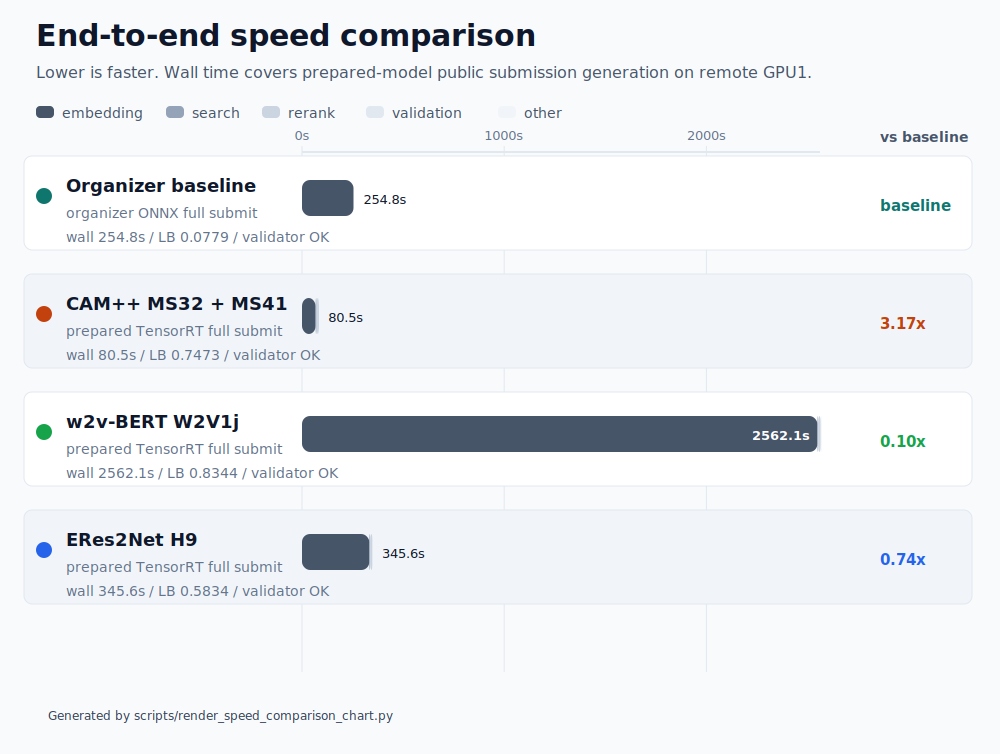

# Kryptonite ML Challenge 2026

Репозиторий команды **Квадрицепс** для задачи распознавания дикторов по голосу.
Главная пользовательская точка входа — [`run.sh`](./run.sh), который собирает
финальный `submission.csv` из тестового CSV и аудиофайлов.

## Быстрый старт для submission

По умолчанию запускается финальный путь `w2v-trt`: скрипт собирает Docker-образ,
докачивает недостающие веса выбранной модели в `data/models/...` и записывает
итоговый файл в корень репозитория как `submission.csv`.

```bash
./run.sh --test-csv "/path/to/test_public.csv" --data-root "/path/to/data_root"
```

Пример для локальной раскладки данных:

```bash
./run.sh \
  --test-csv "data/Для участников/test_public.csv" \
  --data-root "data/Для участников"
```

Если в CSV строки имеют вид `test_public/000001.flac`, то `--data-root` должен
указывать на папку, внутри которой лежит каталог `test_public/`.

В host mode можно передавать и абсолютные пути вне репозитория: wrapper сам
примонтирует внешний `CSV` и `data-root` в контейнер.

Результаты запуска:

| Путь | Что появится |
| --- | --- |
| `submission.csv` | Итоговый файл для загрузки |
| `data/submission_entrypoint/` | Промежуточные артефакты, валидация и служебные файлы |
| `data/models/` | Автоматически скачанные веса и runtime-артефакты |

Минимальные параметры:

| Параметр | Назначение |
| --- | --- |
| `--test-csv` | CSV со списком файлов и колонкой `filepath` |
| `--data-root` | Корневая папка для путей из `filepath` |
| `--output-dir` | Куда писать промежуточные файлы; по умолчанию `data/submission_entrypoint` |
| `--model` | Модель для submission; по умолчанию `w2v-trt`, альтернатива `campp-pt` |
| `--offline` | Не скачивать недостающие веса из сети |

Полные organizer-facing параметры:

| Параметр | По умолчанию | Назначение |
| --- | --- | --- |
| `--model` | `w2v-trt` | Выбор модели: `w2v-trt` или `campp-pt` |
| `--test-csv` | нет | Путь к входному CSV |
| `--data-root` | нет | Корневая папка для путей из `filepath` |
| `--output-dir` | `data/submission_entrypoint` | Куда писать промежуточные файлы |
| `--device` | `cuda` | Устройство инференса |
| `--batch-size` | зависит от модели | Переопределение основного размера батча |
| `--top-k` | `10` | Сколько соседей писать в `submission.csv`; внутри tail-скриптов передаётся как `--output-top-k` / `output_top_k` |
| `--offline` | выключен | Запретить скачивание весов из сети |
| `--dry-run` | выключен | Только показать команды без запуска |

Параметры моделей по умолчанию:

| Модель | Бэкенд | Батч | Дополнительно |
| --- | --- | --- | --- |
| `w2v-trt` | TensorRT | `512` | `num-workers=4`, `prefetch-factor=1`, `search-batch-size=4096`, `top-cache-k=300`, `crop-seconds=6.0`, `n-crops=3`, `precision=bf16` |
| `campp-pt` | PyTorch | `256` | `frontend-workers=16`, `frontend-prefetch=256`, `search-batch-size=4096`, `top-cache-k=200`, `class-batch-size=4096`, `class-top-k=5` |

Примеры переопределения:

```bash
./run.sh \
  --model campp-pt \
  --batch-size 96 \
  --test-csv "/path/to/test_public.csv" \
  --data-root "/path/to/data_root"

CAMPP_BATCH_SIZE=384 ./run.sh \
  --model campp-pt \
  --test-csv "/path/to/test_public.csv" \
  --data-root "/path/to/data_root"

W2V_BATCH_SIZE=1536 ./run.sh \
  --test-csv "/path/to/test_public.csv" \
  --data-root "/path/to/data_root"

TOP_K=100 ./run.sh \
  --test-csv "/path/to/test_public.csv" \
  --data-root "/path/to/data_root"

./run.sh \
  --offline \
  --test-csv "/path/to/test_public.csv" \
  --data-root "/path/to/data_root"
```

Для organizer-facing запуска размер батча задаётся через `run.sh`: либо флагом
`--batch-size`, либо model-specific env (`CAMPP_BATCH_SIZE`, `W2V_BATCH_SIZE`).
Ширина ответа задаётся через `--top-k` или `TOP_K`; это значение прокидывается в
исследовательские tail-скрипты как `output_top_k`. Редактировать research-конфиги
под конкретную GPU не требуется.

Что скачивается автоматически:

| Модель | Артефакты |
| --- | --- |
| `w2v-trt` | TensorRT engine `data/models/w2v_trt/model.plan` и teacher bundle `data/models/w2v_trt/teacher_peft/` |
| `campp-pt` | Checkpoint `data/models/campp/campp_encoder.pt` |

## Навигация

| Что нужно найти | Путь | Зачем |
| --- | --- | --- |
| Финальный отчёт | [docs/kryptonite-tembr-final-report.pdf](./docs/kryptonite-tembr-final-report.pdf) | Описание подхода, результата и выводов для организаторов |
| Презентация | [docs/kryptonite-tembr-presentation.pdf](./docs/kryptonite-tembr-presentation.pdf) | Краткая защита решения в формате слайдов |
| EDA notebook | [research/notebooks/eda.ipynb](./research/notebooks/eda.ipynb) | Разведочный анализ данных и артефактов |
| Графики | [research/docs/assets/](./research/docs/assets/) | Готовые изображения для README, отчёта и анализа экспериментов |
| Лог экспериментов | [docs/experiment_log.md](./docs/experiment_log.md) | Краткая история запусков, public leaderboard и принятых решений |
| Контракт входа/выхода | [docs/model-task-contract.md](./docs/model-task-contract.md) | Формат входного CSV и итогового `submission.csv` |
| Manifest весов | [deployment/artifacts.toml](./deployment/artifacts.toml) | Список runtime-артефактов и публичных ссылок на веса |
| Research-раздел | [research/README.md](./research/README.md) | Полная исследовательская часть: EDA, trails, скрипты и архивы |

## Структура репозитория

| Путь | Назначение |
| --- | --- |
| `docs/` | Финальная документация, отчёт, контракт и журнал экспериментов. |
| `configs/` | Общие и будущие финальные runtime-конфиги. |
| `scripts/` | Корневые CLI-вспомогательные скрипты. Основной entrypoint живёт в `run.sh`. |
| `deployment/` | Docker, manifest весов и материалы финального runtime. |
| `code/campp/` | Основной CAM++ baseline и финальный MS42-style runtime. |
| `research/archive/legacy-baselines/wavlm/` | Архивный WavLM baseline; не участвует в текущем финальном submit path. |
| `src/kryptonite/` | Общий библиотечный код проекта. |
| `tests/` | Тесты живого кода и финального пути. |
| `research/` | EDA, notebooks, журнал экспериментов, benchmark-скрипты, архивы и historical runbooks. |
| `artifacts/` | Локальные выходные файлы, логи, кеши и recorded runtime results. |
| `data/` | Локальные данные, веса, логи, runs и submissions. |

## Текущий лучший public-кандидат

На текущем снимке репозитория лучший зафиксированный public-результат — `0.8344`.
Он получен финальным `w2v-trt` / W2V-путём, который используется в быстром старте
по умолчанию.

Подробности по кандидату зафиксированы в
[`research/docs/trails/current-public-submission-artifact.md`](./research/docs/trails/current-public-submission-artifact.md).

## Графики

Готовые графики лежат в [`research/docs/assets/`](./research/docs/assets/):

- [`public-lb-score.svg`](./research/docs/assets/public-lb-score.svg) — динамика public leaderboard score.
- [`speed-comparison.svg`](./research/docs/assets/speed-comparison.svg) — сравнение скорости полного формирования submission.




## Задача

Организаторы поставили задачу построить модель распознавания по голосу, устойчивую
к искажениям аудиосигнала в реальных сценариях эксплуатации речевых интерфейсов и
систем обработки звука.

Решение должно быть устойчиво к:

- искажениям акустической среды;
- посторонним шумам;
- реверберации;
- большому расстоянию до микрофона;
- искажениям каналов связи.

Материалы организаторов:

- [Файл постановки](<./research/archive/org-materials/Файл постановки.pdf>)
- [Критерии оценки](<./research/archive/org-materials/Критерии оценки.pdf>)
- [Шаблон отчета](<./research/archive/org-materials/Шаблон отчета.docx>)
- [Датасет](https://cloud.mail.ru/public/nfCM/TJyFmWocA)
- [Шаблон submission CSV](https://lk.dataton-kryptonite.ru/storage/docs/doc-1775874035.csv)

## Команда

Команда: **Квадрицепс**

Участники:

- Максим Клещенок
- Сахабутдинов Рустам
- Роман Громов
- Алексей Галиев
