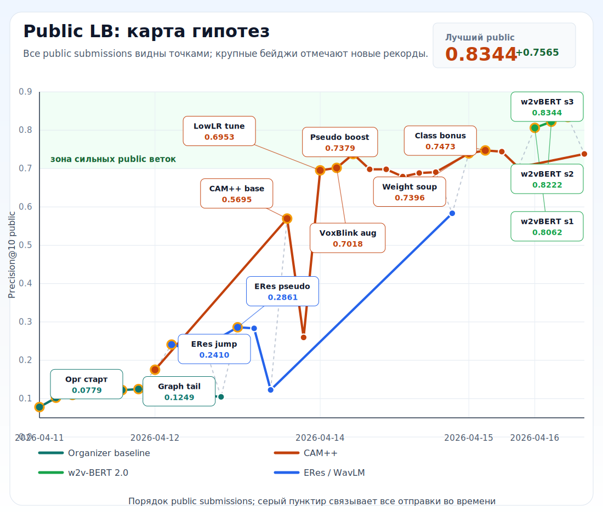

# Kryptonite ML Challenge 2026

Репозиторий содержит решение задачи поиска похожих голосов.

На вход подаётся тестовый CSV со списком аудиофайлов. На выходе получается
`submission.csv`: для каждого аудиофайла указаны 10 самых похожих файлов из той же
тестовой выборки.

Итоговый рейтинг считается по закрытой private-выборке. Открытый public leaderboard
использовался только как внешний ориентир.

## Исходная задача

Задача: разработать модель распознавания по голосу, устойчивую к искажениям
аудиосигнала в реальных сценариях эксплуатации речевых интерфейсов и систем обработки
звука.

Модель должна быть устойчивой к:

- искажениям акустической среды;
- посторонним шумам;
- реверберации;
- большому расстоянию до микрофона;
- искажениям каналов связи.

Материалы организаторов:

- [Файл постановки](<./docs/orgs/Файл постановки.pdf>)
- [Критерии оценки](<./docs/orgs/Критерии оценки.pdf>)
- [Шаблон отчёта](<./docs/orgs/Шаблон отчета.docx>)
- [Датасет](https://cloud.mail.ru/public/nfCM/TJyFmWocA)
- [Шаблон submission CSV](https://lk.dataton-kryptonite.ru/storage/docs/doc-1775874035.csv)

## Команда

Команда: **Квадрицепс**

Участники:

- Максим Клещенок
- Сахабутдинов Рустам
- Роман Громов
- Алексей Галиев

## Главное

1. Самодостаточный отчёт по решению: [docs/challenge-solution-report.md](./docs/challenge-solution-report.md)
2. Как получить и проверить `submission.csv`: [docs/release-runbook.md](./docs/release-runbook.md)
3. Ускорение инференса и команды ONNX/TensorRT:
   [docs/inference-acceleration.md](./docs/inference-acceleration.md)
4. Что лежит в репозитории и зачем: [docs/repository-file-inventory.md](./docs/repository-file-inventory.md)
5. Полный leaderboard и лабораторный журнал: [docs/challenge-experiment-history.md](./docs/challenge-experiment-history.md)
6. Подробные trail-записи экспериментов: [docs/trails/](./docs/trails/)
7. Финальный evidence bundle: [artifacts/release-bundles/ms41-final-evidence-v1/submission_bundle.md](./artifacts/release-bundles/ms41-final-evidence-v1/submission_bundle.md)

## Текущий лучший кандидат

- идентификатор запуска: `MS41_ms32_classaware_c4_weak_20260415T0530Z`
- score на открытой части теста: `0.7473`
- recorded path файла отправки в release workspace:
  `artifacts/submissions/MS41_ms32_classaware_c4_weak_20260415T0530Z_submission.csv`
- SHA-256:
  `8b58013c3a710ef7e4c9f2fc5466ee9b2918d2ee271b5eaaa095b4976e194e84`

Repo-versioned documentary bundle для этого кандидата лежит в
[artifacts/release-bundles/ms41-final-evidence-v1/submission_bundle.md](./artifacts/release-bundles/ms41-final-evidence-v1/submission_bundle.md).

Этот score не является финальной оценкой. Он показывает качество на открытой части теста.
Для private используется тот же пайплайн инференса и постобработки.

## Динамика Public LB



Цветные линии показывают только базовые семейства моделей: `Organizer baseline`,
`CAM++`, `w2v-BERT 2.0` и `ERes / WavLM`. Здесь `Organizer baseline` включает и
исходный baseline от организаторов, и наши ранние улучшения той же базовой
модели. Псевдо-лейблинг, C4-tail, router, soup и другие надстройки не вынесены
в отдельные цвета. Бейджи отмечают поворотные точки.

Пересборка графика из таблицы истории:

```bash
uv run python scripts/render_public_lb_chart.py
```

## Сравнение скорости


Этот график сравнивает полное формирование public `submission.csv` на `remote-gpu`
`GPU1` после подготовки моделей/engines. Экспорт ONNX и сборка TensorRT записаны
в журнале как preparation phase, но не входят в speed score.

Пересборка графика:

```bash
uv run --group train python scripts/collect_speed_family_results.py
uv run python scripts/render_speed_comparison_chart.py
```

## Как устроено решение

Коротко:

1. Прочитать аудиофайлы.
2. Привести звук к единому формату.
3. Построить числовой вектор голоса для каждого файла.
4. Найти ближайших соседей.
5. Улучшить список соседей графовой постобработкой.
6. Записать `submission.csv`.
7. Проверить файл валидатором.

Подробное объяснение находится в [docs/challenge-solution-report.md](./docs/challenge-solution-report.md).

## Быстрый запуск

Требования:

- Python `3.12`
- `uv`
- Linux
- CUDA GPU для полного пересчёта
- данные организаторов в `datasets/Для участников/`

Финальное обучение запускалось на GPU внутри Docker-образа
`nvcr.io/nvidia/pytorch:26.03-py3`. Для инференса можно использовать тот же образ или
совместимое CUDA-окружение с зависимостями из `uv`.

Установка зависимостей:

```bash
uv sync --dev --group train --group infer --group eda
```

Точные команды для получения финального `submission.csv` находятся в
[docs/release-runbook.md](./docs/release-runbook.md).

Проверка готового файла:

```bash
uv run python scripts/validate_submission.py \
  --template-csv datasets/Для\ участников/test_public.csv \
  --submission-csv submission.csv \
  --output-json artifacts/release/submission_validation.json
```

Ожидаемый результат: `passed=True`, без ошибок формата.

## Структура репозитория

| Путь | Простое назначение |
| --- | --- |
| `src/kryptonite/` | Основной код решения. |
| `scripts/` | Команды запуска обучения, инференса, EDA и проверок. |
| `configs/` | Конфиги обучения и инференса. |
| `docs/` | Отчёт, история экспериментов, runbook и пояснения для жюри. |
| `tests/` | Тесты и проверки контрактов. |
| `baseline/` | Исходная baseline-ветка и исправления для сравнения. |
| `apps/`, `deployment/` | API и Docker-инфраструктура. Не основной путь для финального `submission.csv`. |
| `artifacts/` | Локальные веса, кеши, отчёты и отправки. Не хранится в git. |
| `datasets/` | Локальные данные. Не хранится в git. |

Подробный реестр файлов находится в [docs/repository-file-inventory.md](./docs/repository-file-inventory.md).

Правила репозитория и используемые инструменты разработки описаны в [AGENTS.md](./AGENTS.md).
